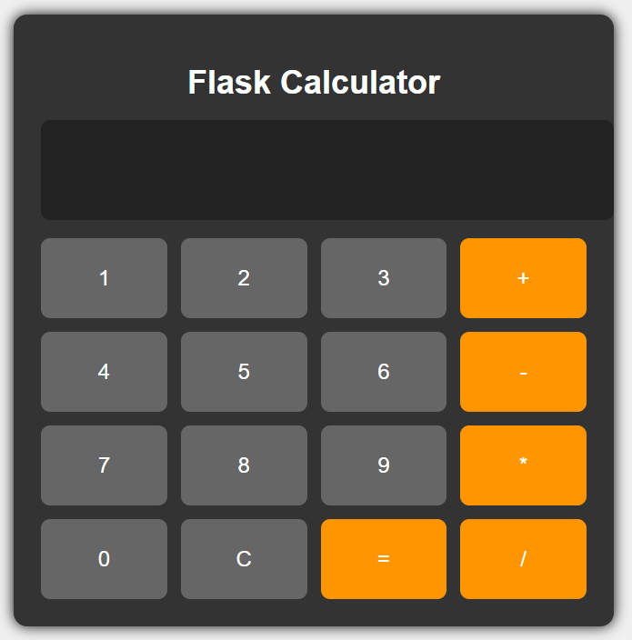

Nom du projet : Calculatrice Web

Numéro d’équipe : 29

Objectif : Utiliser une calculatrice simple via une interface web permettant les opérations telles que l'addition, la soustraction, la multiplication et la divison.

## Prérequis d’installation
- Python 3.8+
- Flask

## Instructions d’installation
# 1. Clôner le dépot
    git clone [https://](https://github.com/ThisHobbit/TP3---LOG3000_2203165_2222627.git)

# 2. Créer un environnement virtuel Python
    python -m venv .venv
     .\.venv\Scripts\Activate.ps1

# 3. Installer les dépendances
    pip install -r requirements.txt

# 4. Rouler l'application
    python -m flask run

# 5. Accéder à l'application web dans le navigateur de votre choix sous l'adresse http://127.0.0.1:5000

## Utilisation
L'application ressemble à ceci :

Il est possible de sélectionner des chiffres et des opérateurs afin de former une expression qui pourra être calculée.

Il n'est possible de calculer que des opérations simples avec un seul opérateur. 

Le bouton C permet d'effacer l'affichage et la mémoire de la calculatrice afin de recommencer à zéro.

L'application utilise une API REST pour calculer ses résultats:
- POST /api/calculate
    Payload JSON : { "operand1": 3, "operand2": 4, "operation": "add" }
    Réponse JSON : { "result": 7 }
- Validation : l'API vérifie les entrées et retourne des codes d'erreur (400) en cas de données invalides (division par zéro, format non numérique, etc.).

Exemple : 
- 1+1 ok
- 1+2+3 erreur
- 12+ erreur

## Tests
Les tests visent à vérifier l'implémentation de la classe operators qui comprend les fonctions d'addition de soustraction, de multiplication et de division.

Afin de lancer les tests, simplement rouler dans le terminal la commande suivante :
python -m unittest discover -s tests

## Contribution workflow
1. Ouvrir une issue décrivant le bug ou la fonctionnalité souhaitée.
2. Créer une branche dédiée nommée `feature/<description>` ou `fix/<description>` à partir de `main`.
3. Faire des commits atomiques et lisibles ; utiliser le format :
   feat: brève description
   fix: corrige ...
4. Pousser la branche et ouvrir une Pull Request vers `main`. Inclure :
   - Description claire du changement
   - Captures d'écran si UI modifiée
   - Référence à l'issue liée
5. Relectures / approbations : au moins une approbation avant fusion.
6. Fusion : utiliser merge commit ou squash selon la politique du dépôt, supprimer la branche après fusion.

Notes sur la structure du dépôt
------------------------------
Des README spécifiques ont été ajoutés aux sous-répertoires :

- `utils/README.md` : décrit les utilitaires (opérations arithmétiques).
- `static/README.md` : décrit les ressources statiques (CSS, images).
- `templates/README.md` : décrit les gabarits HTML.
